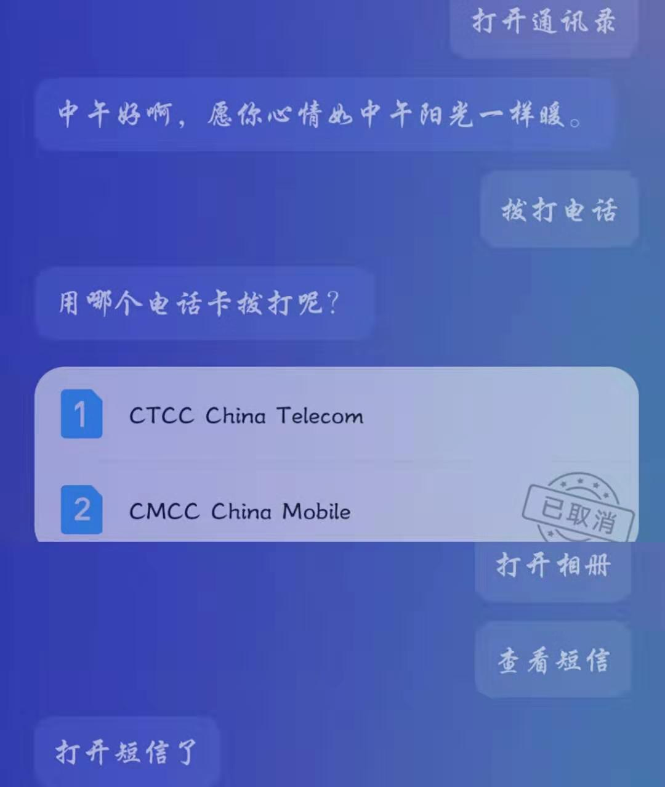
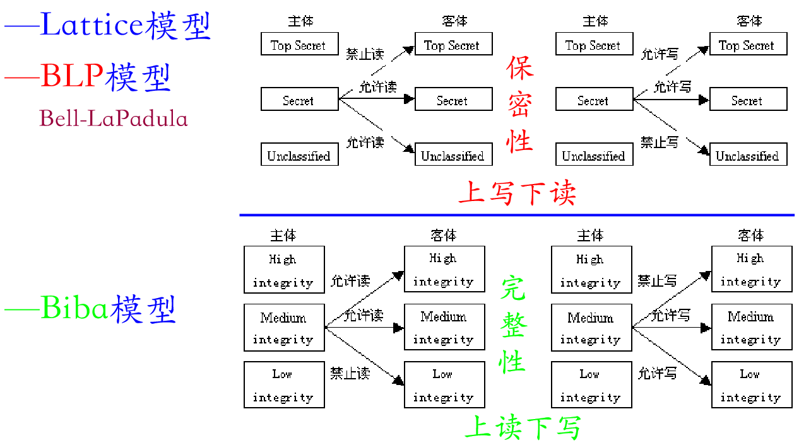
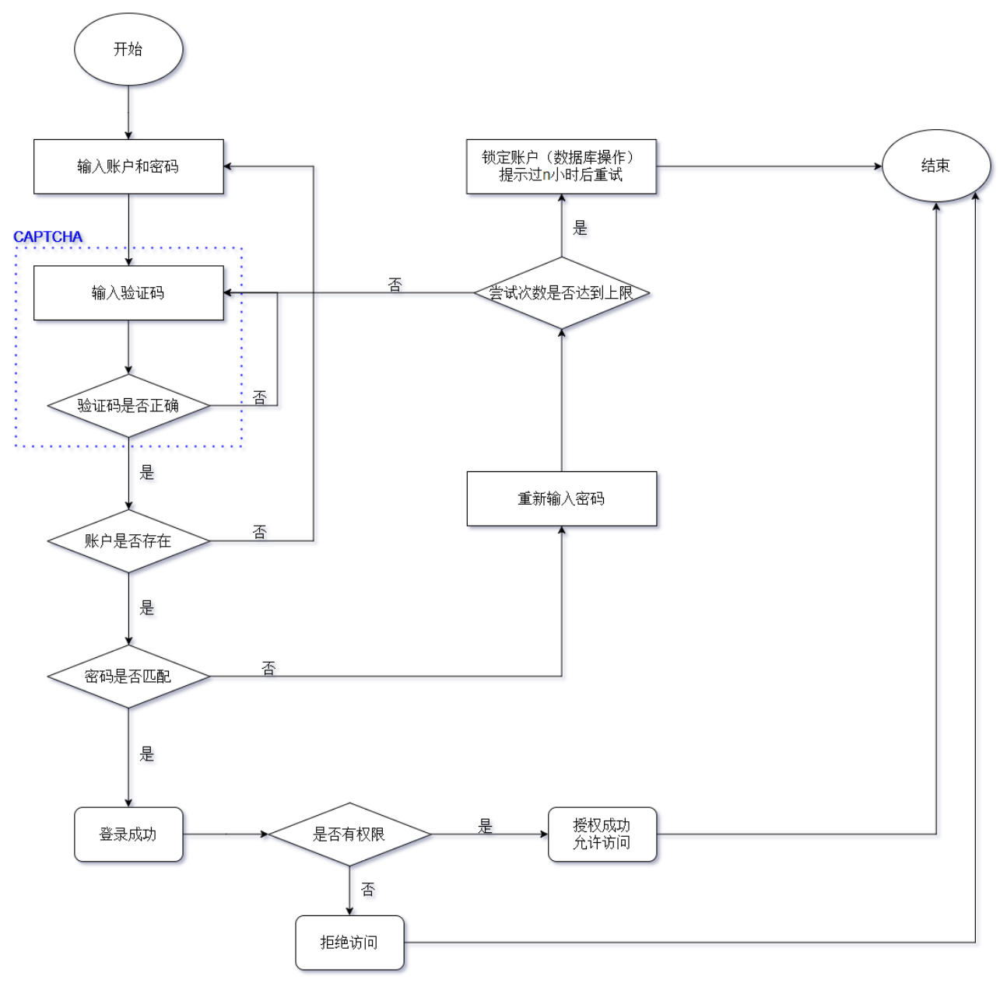
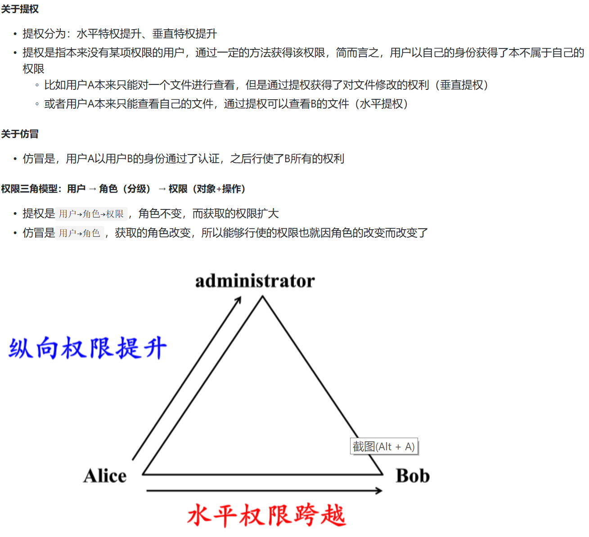

# 操作系统的访问控制设计实例研究
以 Android 系统为研究对象  
## 实验环境
手机型号：vivo x23  
系统版本：vivo rev 6.23.5  
## 当系统处于锁屏状态下接收到新短信时，不解锁情况下
- [x] 系统是否允许查看短信内容？  
可以查看
- [x] 系统是否允许回复短信？  
目前，此vivo型号的手机只有未接电话自动回复，没有短信自动回复。
- [x] 安卓上的 App : 以 微信电话本 为例，在接管了系统短信功能和权限之后，是否会有一些不同的功能设定？  
会有，比如搜狗输入法，如果设置权限为系统,就一直使用搜狗输入法，否则不会。又比如，qq或者微信如果设置了可以访问通讯录，那么推荐好友就有通讯录中的人。
## 当系统处于锁屏状态下，使用系统内置（例如 iOS 的 Siri ）或第三方的语音助手可以完成以下哪些操作？  
使用 jovi voice
- [x] 访问通讯录  
"打开通讯录"，弹出通讯录
- [x] 拨打电话  
可以
- [x] 访问相册  
可以
- [x] 查看短信收件箱  
可以
- [x] 如果你的手机支持指纹识别解锁手机，请实验并分析指纹识别相比较于简单密码、复杂密码、图形解锁、人脸识别解锁、声纹解锁等解锁方式的安全性、便利性差异。    
支持，但是是否能正确解锁与录入指纹时有关系，有时候不容易识别出来，感觉不太方便。人脸很容易识别，甚至距离较远也会识别，只要捕捉到人脸就迅速解锁，虽然方便，但是有时候我并不想解锁，比如我只是想看看时间。没有再使用图形解锁和声纹解锁，密码解锁使用的是6位。  

思考题：
- [x] 以上设计实现方式属于我们课堂上讲过的哪种强制访问控制模型？Lattice/BLP？Biba？
BLP模型，上写下读。

- [x] 系统或第三方应用程序是否提供了上述功能的访问控制规则修改？如果修改默认配置，是提高了安全性还是降低了安全性？  
提供了上述功能的访问控制规则修改，如果修改默认配置，是降低了安全性。
* 实验注意事项：
请准确记录、描述你的实验运行环境信息，包括但不限于：操作系统版本（如果是第三方应用，请给出精确版本号）、硬件设备型号、是否默认设置。
请综合运用访问控制模型、威胁建模、安全假设和信任等专业知识和语言论证以上安全问题。
## 课后题
- [x] 生物特征身份认证方式有哪些？优缺点分析？应用场景举例。  
[生物特征认证](https://blog.csdn.net/lailxn/article/details/6019874)，比如刷脸进校
- [x] “找回口令功能”和“忘记密码”在访问授权机制中的意义？请尝试设计几种安全的“找回口令功能”，详细描述找回口令的用户具体操作过程。  
[师姐的优秀回答](https://github.com/CUCCS/2018-NS-Public-jckling/blob/ns-0x02/ns-0x02/2.md)  
找回口令：  
现在主要是通过邮箱或手机号码进行找回，给邮箱和手机号码发送验证码，因此只有本人才能获得验证码，有些为了防止是机器人找回，还会进行人机校验(比如拖动图片，google的根据内容选出图片)。  
最早期，比如腾讯qq，有密保问题进行验证，三个问题只要给出其中某一个答案就可以找回，是很不安全的。因为，很少会用到，为了使用的时候能够正确回答，大多数人会选择填写真实的信息作为答案，那如果我很了解那个人的信息，或者经过某种手段获得了答案的话，那么更改密码是很容易的。
- [x] 绘制用户使用用户名/口令+图片验证码方式录系统的流程图。考虑认证成功和失败两种场景，考虑授权成功和失败两种场景。  
[师姐的优秀回答](https://github.com/CUCCS/2018-NS-Public-jckling/blob/ns-0x02/ns-0x02/2.md) 

- [x] Windows XP / 7 中的访问控制策略有哪些？访问控制机制有哪些？  
[官方回答](https://docs.microsoft.com/zh-cn/windows/win32/secauthz/access-control-components?redirectedfrom=MSDN)
- [x] 用权限三角形模型来理解并描述下 2 种威胁模型：提权、仿冒。  
[师姐的优秀回答](https://github.com/CUCCS/2018-NS-Public-jckling/blob/ns-0x02/ns-0x02/2.md)

- [x] 试通过操作系统的访问控制机制来达到预防一种真实病毒的运行目的。  
比如熊猫烧香病毒，需要在注册表中删除自启动文件。  
- [x] 什么是 OAuth？  
[OAuth官方文档](https://oauth.net/2/)  
[OAuth2.0是什么](https://www.cnblogs.com/flashsun/p/7424071.html)
- [x] 什么是 OpenID？  
[什么是OpenID](https://www.cnblogs.com/iskyoole/articles/2659273.html)  
- [x] 试用本章所学理论分析 0Auth 和 OpenID 的区别与联系。  
[OpenID和OAuth的区别](https://blog.csdn.net/xihuanyuye/article/details/81126465)
- [x] 如何使用 OAuth 和 OpenID 相关技术实现单点登录（Single Sign On）？  
[认证与授权——单点登录协议盘点：OpenID vs OAuth2 vs SAML](https://www.jianshu.com/p/5d535eee0a9b)  
[OAuth实现单点登录](https://www.cnblogs.com/cjsblog/p/10548022.html)