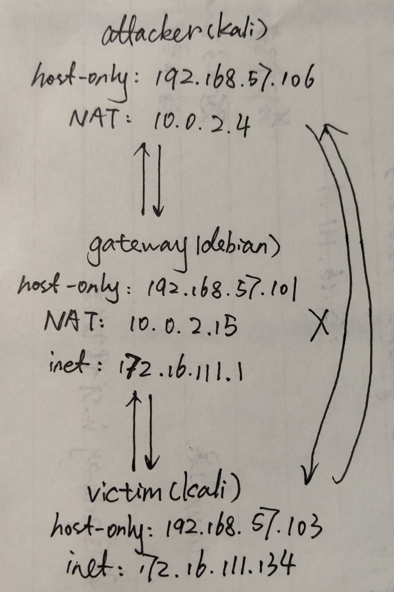
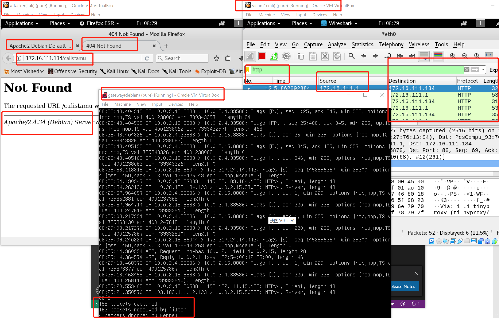
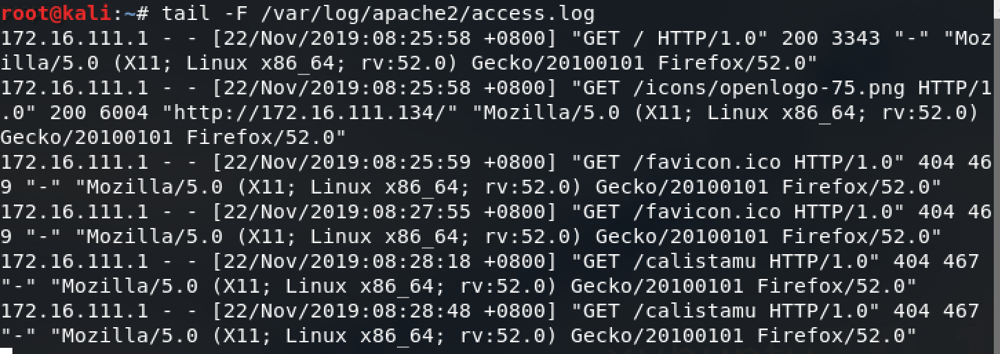
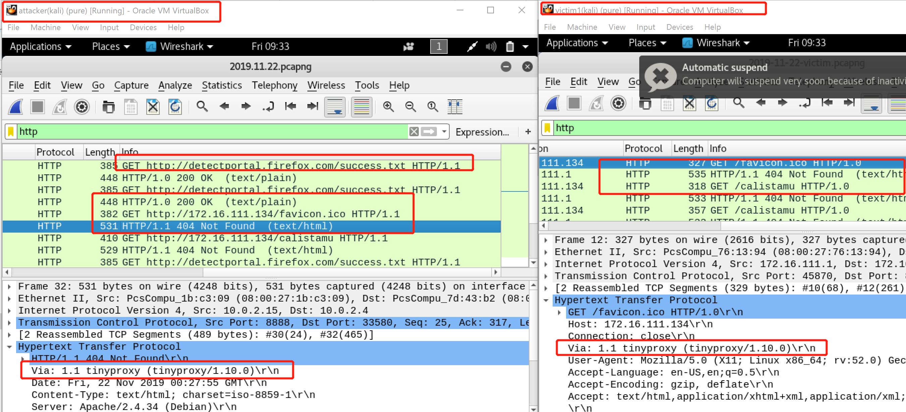
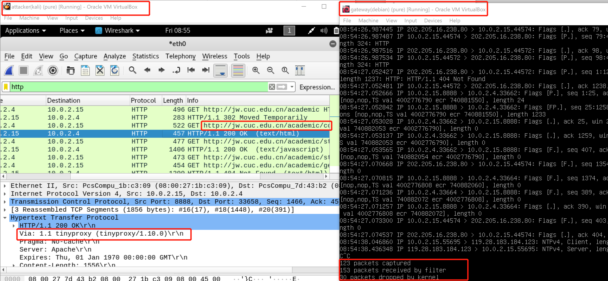

# HTTP正向代理服务器实验

## 实验拓扑



## 实验步骤

1. 分别开启attacker-kali和victim-kali的apache服务，发现attacker-kali不可以访问victim-kali的apache页面，victim-kali可以访问attacker-kali的apache页面
2. 正向代理设置  
  victim-kali开启apache2服务，并查看是否正常开启
```
service apache2 start  
psaux | grep apache
 ```  
attakcer-kali手工设置代理地址10.0.2.15，端口8888

gateway-debian安装tinyproxy  
```
apt-get update && apt-get install tinyproxy
```  
gateway-debian编辑配置文件，设置代理网段，此处为'Allow 10.0.0.0/8'   
```
vi /etc/tinyproxy/tinyproxy.conf
```  
  
gateway-debian开启代理服务  
```
service tinyproxy start
```
3. attacker-kali网页分别访问172.16.111.134和172.16.111.134/calistamu,同时在attakcer-kali,gateway-debian,victim-kali进行抓包。  

看到：attcker-kali网页前者访问成功，后者404错误。attacker-kali抓到的http包源地址都是10.0.2.4(attacker的ip)，目的地址都是10.0.2.15(gateway的ip)。gateway-debian有流量通过，且有详细信息可以看出是谁发给谁。victim-kali抓到的http包，源地址都是172.16.111.1(gateway的ip)，目的地址都是172.16.111.34(victim的ip)，且日志中有记录
```
tail -F /var/log/apache2/access.log #查看日志
```

attacker抓到的包中看到代理名称。victim中也看到了代理名称，但可以在代理处进行设置，进行伪装。

* Info中若出现'GET /success.txt HTTP/1.1'访问硬编码，表示当前连接安全，是浏览器厂商自己增加的功能，可以根据字段增加过滤条件。
4. attcker-kali访问jw.cuc.edu.cn,网关看到有流量通过.

* 因此，正向代理相当于一个跳板机，服务于客户机，而服务器是无法感知正向代理，通过正向代理，我们可以访问到原来无法访问的资源。
5. 关于包内容的导出与解码  
'File'---'Export Objects'---'HTTP'把当前所有的http协议以列表方式显示，可save all  
选中内容---'Export Packet Bytes'以字节方式保存---'file'命令解码  
* 'file *'会直接解开压缩包的数据，用file指令解码文件
