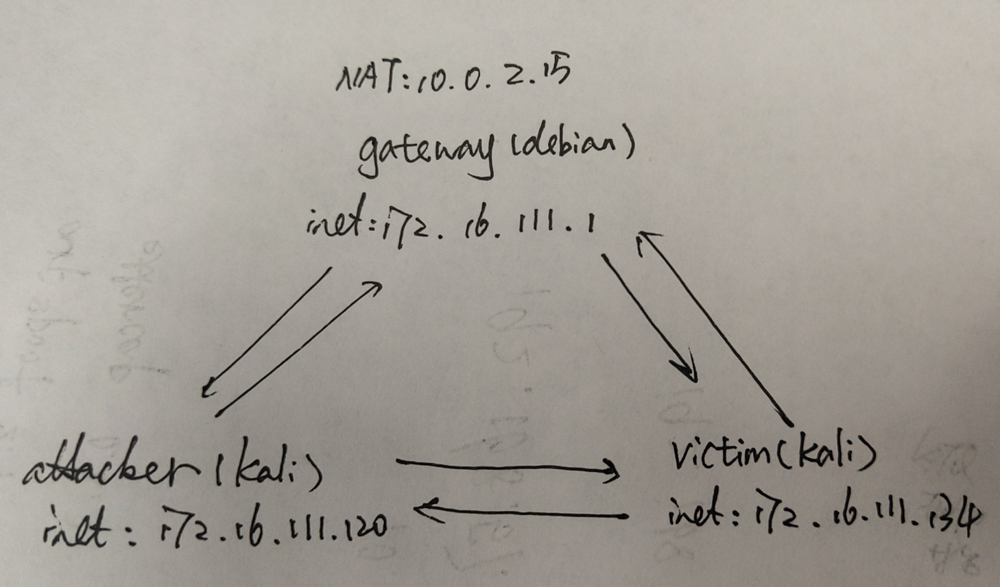
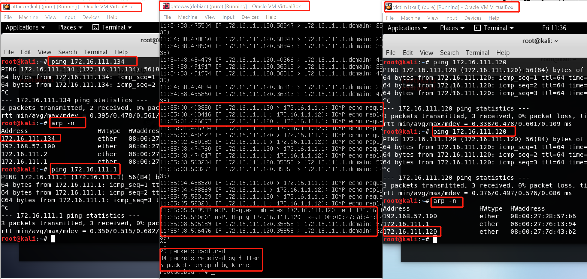
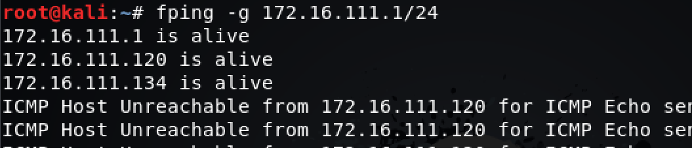
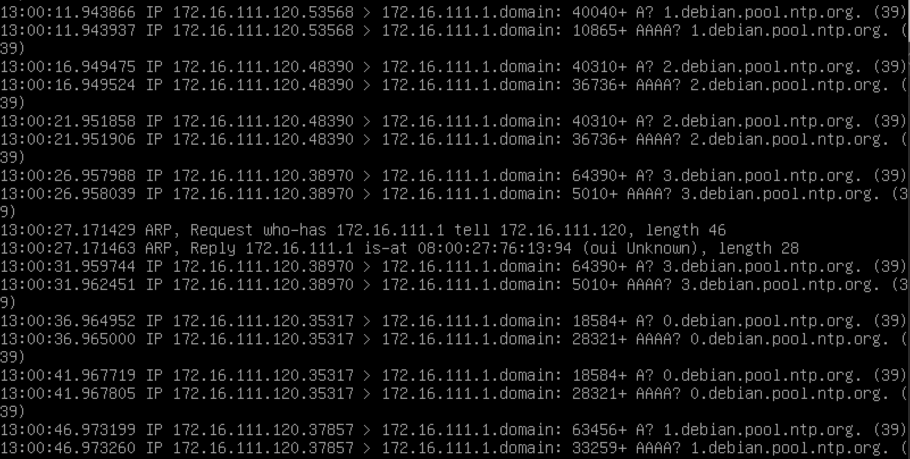
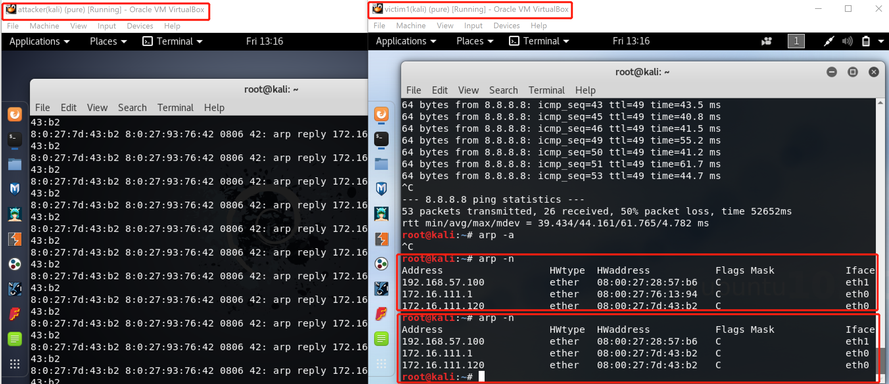
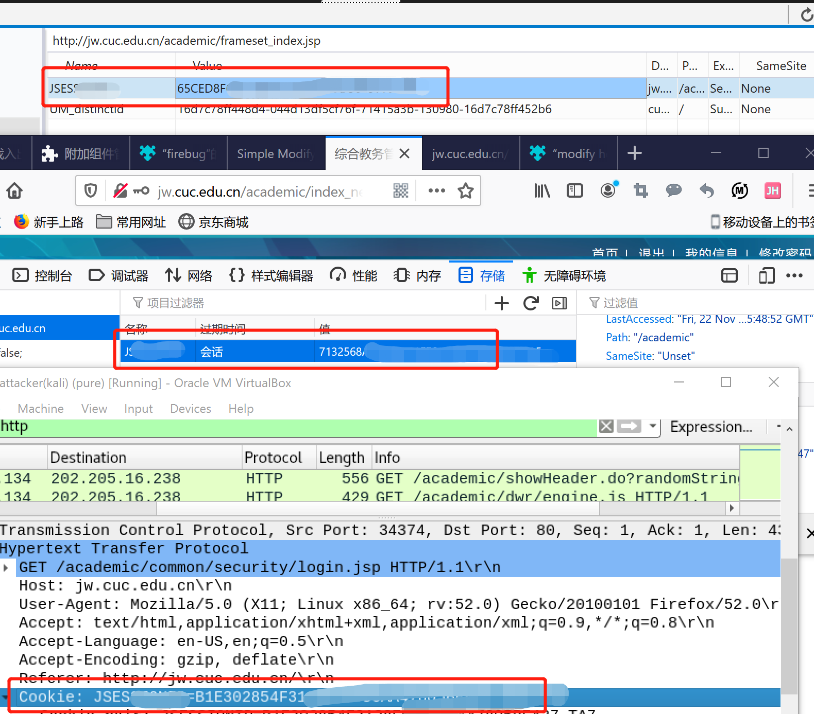

# 网络监听
## 实验完成
- [x]ARP欺骗及监听者检测
- [x]ARP断网攻击
## 实验环境
### 网络拓扑

环境测试

* 最初```arp -n```两个kali没有对方(忘了截图)，互相ping过以后，ip地址在双方的arp缓存表中出现。
* 互相ping的时候看到gateway-debian网关中有收到广播包，为了对比效果，attakcer-kali ping网关，看到网关收到了request,发送了reply。因此，在默认信任的内网中，发送的包能被网络中的所有主机收到，但只有目标主机会回应，在此原理上进行实验。  
因此，我们甚至可以扫描整个内网，选取靶机。

### 实验工具
kali自带arpspoof 2.4或ettercap 0.8.2
```
arpspoof [-i interface] [-c own|host|both] [-t target] [-r] host
```
## 实验步骤
### ARP断网攻击
根据情况而定是否开启了端口转发
```
cat /proc/sys/net/ipv4/ip_forwrd
```
arpspoof进行arp攻击
```
arpspoof -i eth0 -t 目标IP 网关IP       
```
>效果展示:video/arp攻击.mp4
* attacker不断告诉gateway就是网关的目标IP的mac地址是当前主机的mac地址，污染victim的arp地址表，因此gateway把数据包发给attcker。

* 当收到arp攻击，victim不能上网，停止攻击，继续上网。
### ARP欺骗
```
echo 1 >> /proc/sys/net/ipv4/ip_forward
arpspoof -i eth0 -t 172.16.111.134 172.16.111.1
```
看到欺骗前后，victim-kali的arp表有所改变，攻击后，attcker与gateway的mac地址相同

由于开启了端口转发，不影响victim上网，且可以在视频中看到victim上网的请求包是不一样的
>效果展示：video/arp欺骗.mp4

* ARP欺骗：attacker伪装成网关，欺骗靶机，因此，没有开启端口转发的时候会断网，因为attacker没有把victim请求网页访问的包发出去，开启端口转发以后，实质这些数据包还是gateway处理的
## 参考文献
[arp欺骗及攻击](https://blog.csdn.net/niekai01/article/details/)
## 扩展：利用cookie劫持，登入被攻击者的网络账户
安装下载firefox的插件modify headers,将Cookie粘贴复制进去，然后会出现登陆后的页面
* 实验失败，是因为使用jw.cuc.deu.cn进行实验，管理用户会话的Token在注销后过期了，看到“过期时间那里是会话”，每一次的cookie都是新的


