# 基于 Scapy 编写端口扫描器

## 实验要求
完成以下扫描技术的编程实现
- [x] TCP connect scan 
- [x] TCP stealth scan
- [x] TCP Xmas scan 
- [x] TCP fin scan 
- [x] TCP null scan
- [x] UDP scan

* 上述每种扫描技术的实现测试均需要测试端口状态为：开放、关闭 和 过滤 状态时的程序执行结果
* 提供每一次扫描测试的抓包结果并分析与课本中的扫描方法原理是否相符？如果不同，试分析原因；
* 在实验报告中详细说明实验网络环境拓扑、被测试 IP 的端口状态是如何模拟的
* （可选）复刻 nmap 的上述扫描技术实现的命令行参数开关

## 实验环境

1. gateway(debian)、victim1（kali）、victim2(kali),在同一个内网内且两两可以Ping通。
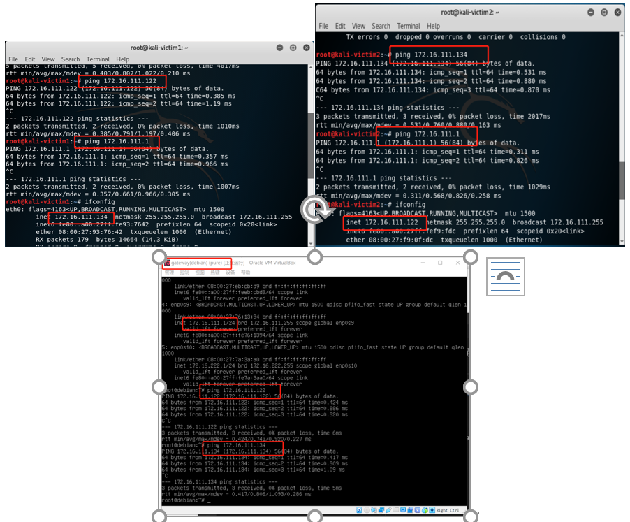
2. python2.7.15+scapy2.4.3
* 报错：'NoneType' object has no attribute 'haslayer'不是Python版本问题，是因为一开始没有判断是否为空，空的话当然没有haslayer

## 实验步骤

[tcpdump学习](https://www.tcpdump.org/manpages/tcpdump.1.html)  
[NMAP手册中端口扫描技术原理及分类学习](https://nmap.org/man/zh/man-port-scanning-basics.html)  
[代码来源及原理学习](https://resources.infosecinstitute.com/port-scanning-using-scapy/)  
[代码实现原理很重要必须懂](https://c4pr1c3.github.io/cuc-ns/chap0x05/main.html)

      systemctl start apache2 #开启80端口
      systemctl stop apache2 #关闭80端口
      netstat -anop | grep LISTEN | grep -v unix #查看开启状态的端口
      iptables -A INPUT -p tcp --dport 80 -j DROP #不接收80端口的数据包
      iptables -A INPUT -p tcp --dport 80 -j ACCEPT #接收80端口的数据包

端口开启和关闭时的状态，由于之后多次重复，此处例举
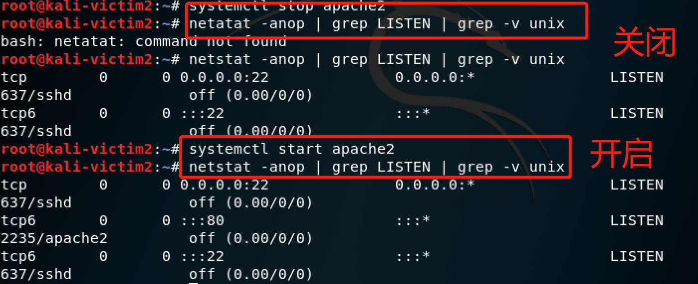

* 所有的实现：  
关闭状态关闭80端口无过滤规则  
开启状态开启80端口无过滤规则  
过滤状态开启80端口添加过滤规则

### TCP connect scan

>py/tcpconnectscan.py  

1. 关闭状态
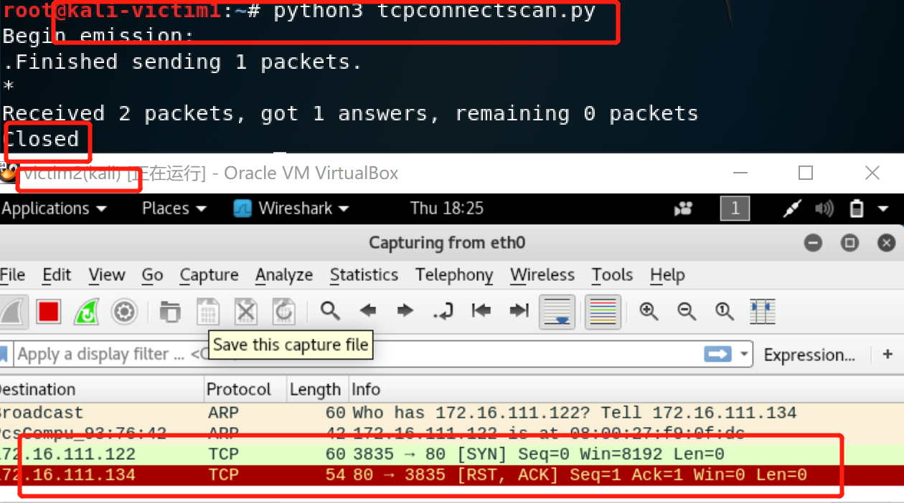
2. 开启状态
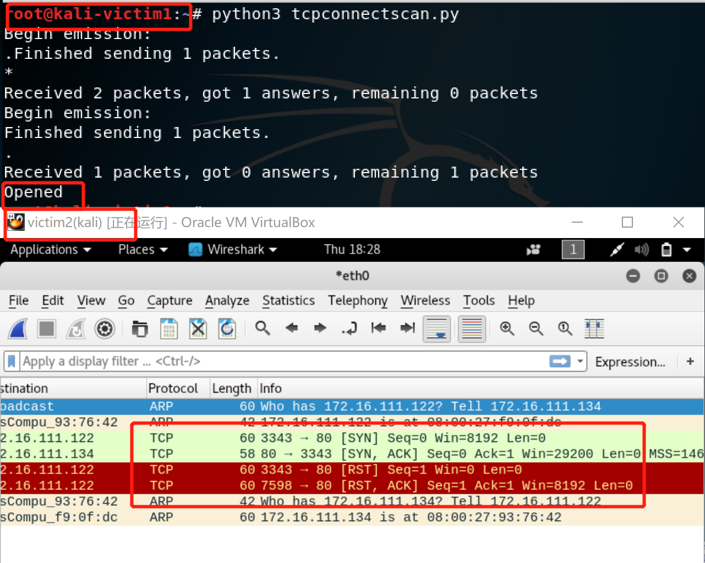
3. 过滤状态
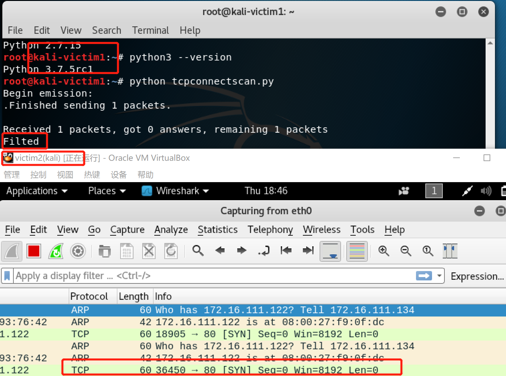

### TCP stealth scan

>py/tcpstealthscan.py

1. 关闭状态
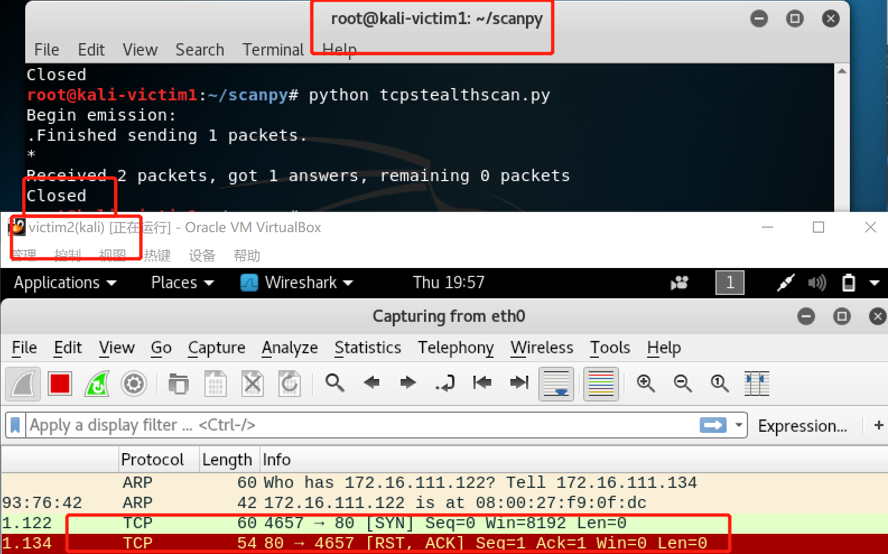
2. 开启状态
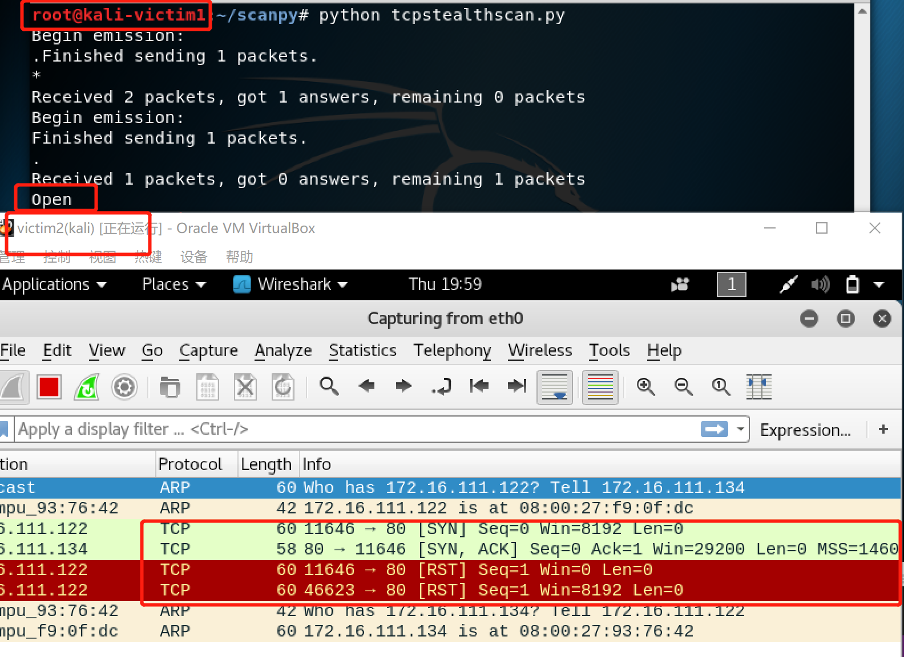
3. 过滤状态

### TCP Xmas scan

>py/tcpxmasscan.py   

1. 关闭状态

2. 开启状态

3. 过滤状态 

### TCP fin scan 

>py/tcpfinscan.py

1. 关闭状态
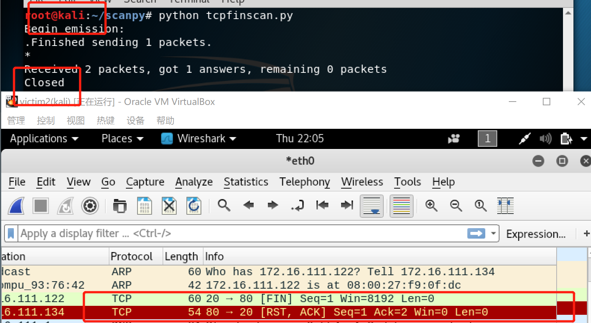
2. 开启状态和过滤状态结果相同
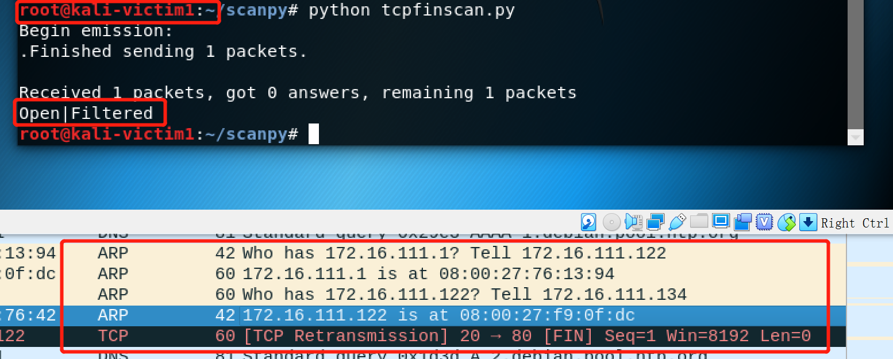

### TCP null scan

>py/tcpnullscan.py

1. 关闭状态
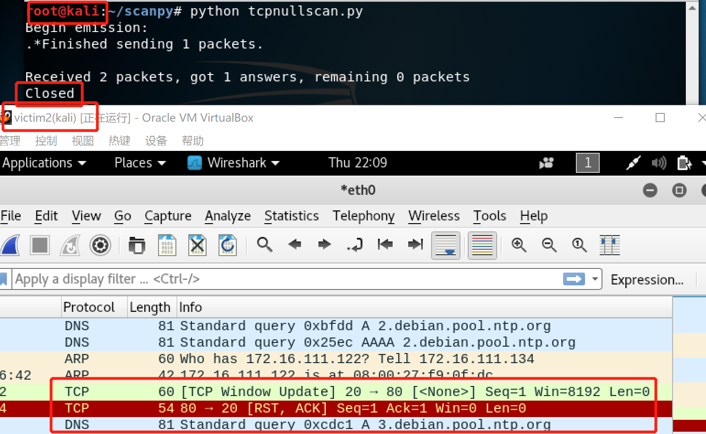
2. 开启状态和过滤状态结果相同
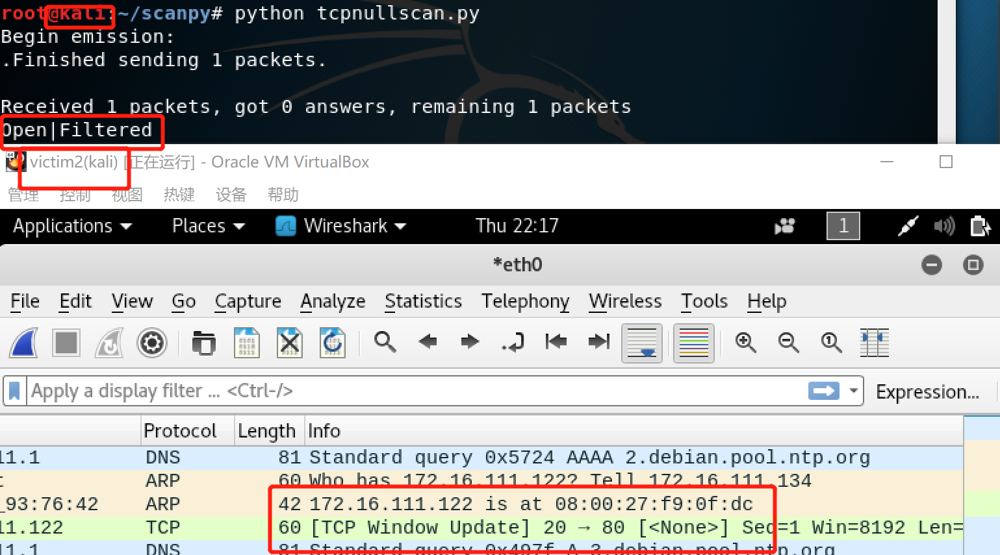

### UDP scan

>py/tcpudpscan.py  

[nc命令学习](https://www.computerhope.com/unix/nc.htm)  

    nc -l -u -p 53 < /etc/passwd #开启53端口
    但是发现我就是用不了这个命令

apt-get install ufw
1. 关闭状态
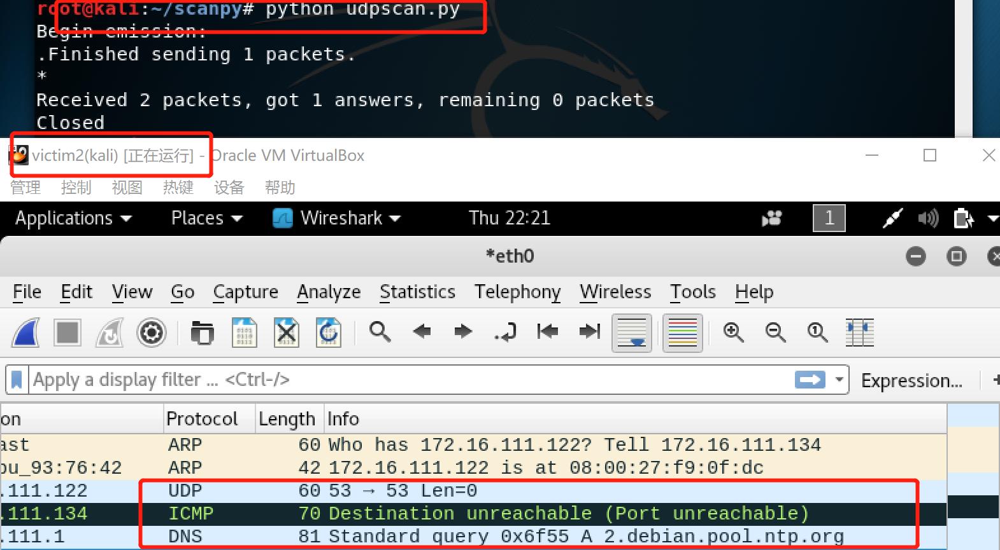
2. 开启状态和过滤状态

* 可以发现一直没有任何回应，而且扫描效率很低，抓closed时需要很久才会出现ICMP包。
* 试图nc开启53端口，没有成功，安装ufw，也没成功，理解了一遍原理，又跑了几遍，突然成功。
## 实验步骤
1. 'NoneType' object has no attribute 'haslayer'不是Python版本问题，是因为一开始没有判断是否为空，空的话当然没有haslayer
## 参考文献
[tcpdump学习](https://www.tcpdump.org/manpages/tcpdump.1.html)  
[NMAP手册中端口扫描技术原理及分类学习](https://nmap.org/man/zh/man-port-scanning-basics.html)  
[代码来源及原理学习](https://resources.infosecinstitute.com/port-scanning-using-scapy/)  
[代码实现原理很重要必须懂](https://c4pr1c3.github.io/cuc-ns/chap0x05/main.html)
[nc命令学习](https://www.computerhope.com/unix/nc.htm) 