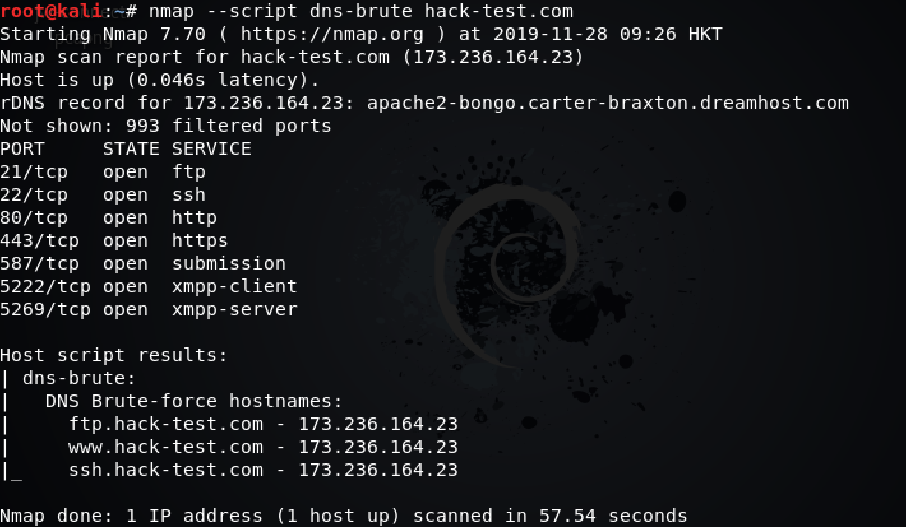
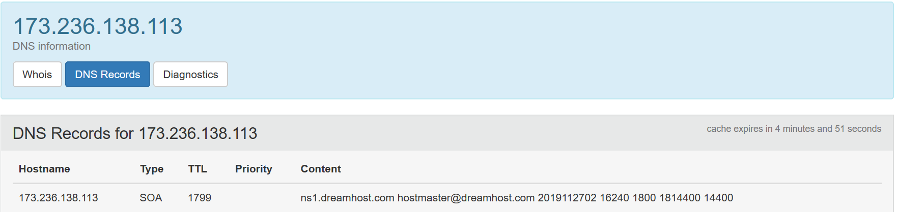
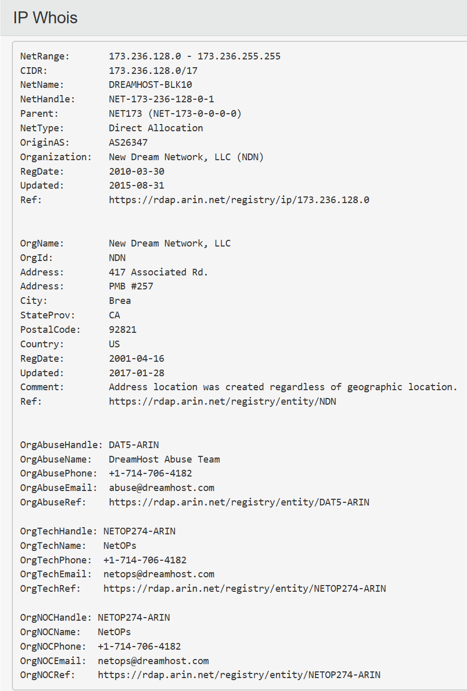
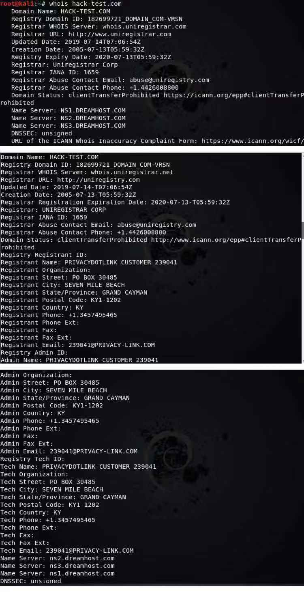
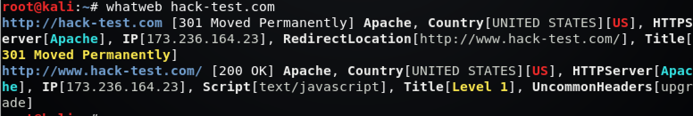
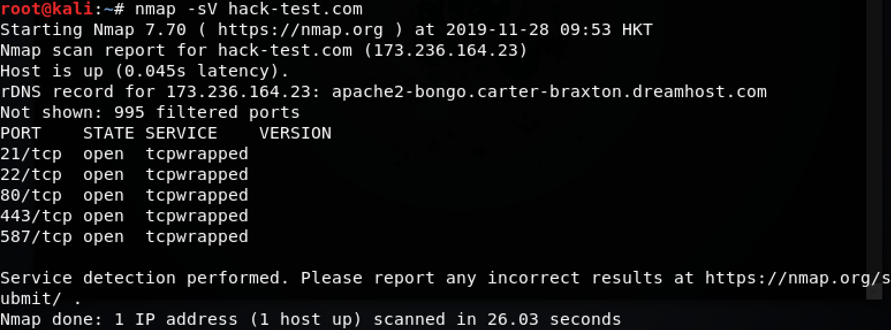
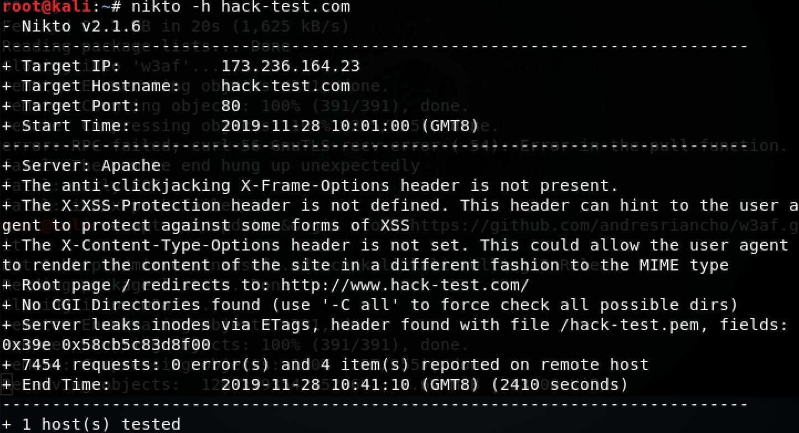

# 网络与系统渗透

## 实验步骤
1. ping hack-test.com 获得网站服务器ip地址173.236.164.23
2. 使用[sameip.org](https://www.sameip.org/ip/)根据Ip地址查找同一台服务器上服务的所有站点，但是我这里出现了500错误。因为此次是尝试，所以其他服务器上信息也没关系。

所以使用枚举DNSserver的主机名
```
nmap --script dns-brute hack-test.com
```


3. 找网站的DNS记录  
a.[who.is](https://who.is/)找网站的DNS记录


b.终端输入```whois hack-test.com```获得网站域名的注册信息、电话、邮箱、地址、web服务器

4. 获取网站服务器操作系统类型和服务器版本

5. 用Nmap查看网站服务器开放的端口  
a.查看运行的服务
b.查看操作系统版本
6. Nikto是一个比较全面的网页扫描器，用Nikto收集漏洞信息 
[nikto官方手册](https://cirt.net/nikto2-docs/)    
[nikto快速入门](https://blog.csdn.net/freeking101/article/details/72872502)  

7.用web应用扫描器  
[w3af安装下载](http://w3af.org/)  