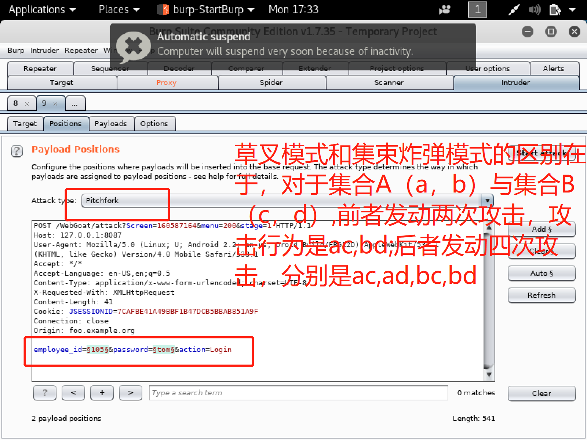

# Web 应用漏洞攻防
## 实验目的
* 了解常见 Web 漏洞训练平台；
* 了解 常见 Web 漏洞的基本原理；
* 掌握 OWASP Top 10 及常见 Web 高危漏洞的漏洞检测、漏洞利用和漏洞修复方法；
## 实验要求
- [x] WebGoat 7.1
- [x] WebGoat 8.0
- [] DVWA
- [] juicy shop
- [] Vulhub
* 每个实验环境完成不少于 5 种不同漏洞类型的漏洞利用练习；
* 可选）使用不同于官方教程中的漏洞利用方法完成目标漏洞利用练习；
* （可选）最大化 漏洞利用效果实验；
* （可选）定位缺陷代码；
* （可选）尝试从源代码层面修复漏洞；
## 实验参考
[Web安全攻防靶场之WebGoat](http://www.xianxianlabs.com/2018/06/03/webgoat1/#i)  
[这一系列文章用于学原理](https://blog.csdn.net/ggf123456789/article/details/23562103)  
[OWASP Top10 2017](http://www.owasp.org.cn/owasp-project/OWASPTop102017v1.3.pdf)
## 实验环境
1. 下载老师给的实验环境文件
```
git clone https://github.com/c4pr1c3/ctf-games.git
```
2. 安装docker,webgoat,juicy shop，dvwa
```
#开启docker服务
sudo service docker start
#后台启动并运行容器
docker-compose up -d
```
* docker、dockerfile、docker-compose区别：  
docker:容器，隔离作用  
dockerfile:用来构建镜像的文本文件,包含构建镜像所需的指令和说明，因为并不是直接生成容器，是构建了镜像，再运行镜像运行容器。   
docker-compose:定义和运行多容器 Docker 应用程序的工具。通过 Compose，您可以使用 YML 文件来配置应用程序需要的所有服务。然后，使用一个命令，就可以从 YML 文件配置中创建并启动所有服务。  
[docker教程](https://www.runoob.com/docker/docker-tutorial.html)

配置如图

3. 准备配置代理，会BurpSuite的基础使用，在训练过程中熟悉使用。[BurpSuite实战指南](https://t0data.gitbooks.io/burpsuite/content/chapter2.html) 

* 为什么设置了代理以后，不开burpsuite无法上网？[burpsuite的https代理原理](https://blog.csdn.net/write_down/article/details/78990182)

4. [关于同时运行docker和burp suite虚拟机卡死的解决](https://www.jianshu.com/p/77435e67980c)

## 实验步骤
### WebGoat7.1漏洞利用
[webgoat7.1实战指南](https://www.cnblogs.com/wuweidong/p/8677431.html)
#### 一、Http Basics
目标：HTTP 请求的基本操作原理  
输入'webgoat'点击'Go'。burpsuite的结果，和用火狐浏览器'网络'中看到的结果，提交的用户名是'webgoat'，method是POST。

#### 二、Access Control Flaws
##### 1.Using an Access Control Matrix
目标：了解访问权限规则
* 第一种方法：依次试（红色字体提示当前用户是否有权限），反正这次作业也不多。
* 第二种方法：使用intruder修改请求参数，来获取不同的请求应答，从而遍历破解。
第二种方法步骤：  
1. 先择可能存在问题的日志，此次选一个method为'POST'的日志，右键'send to intruder'
2. 如下设置


3. 攻击结果

得到权限矩阵如下

##### 2.Bypass a Path Based Access Control Scheme
目标：攻击者可以使用相对路径访问那些通常任何人都不能直接访问或直接请求就会被拒绝的文件  
1. 当前路径：

访问其中某一个资源，发现在同一个文件夹下

2. 通过修改raw里面的路径来进行路径切换，从而访问我们想要访问的资源。根据'POST'请求，找到我们的目标日志，然后'send to repeater',更改'File'的值.

* 不可以直接更改也是搞了很久


* 之前一直以为是重定位到我刚刚选的CSRF.html,也是没有认真读题，目标是'WEB-INF/spring-security.xml',而他的实际路径应该是'./extract/webapps/WebGoat/WEB-INF/spring-security.xml',因此有了上图的相对路径
* 'Go'以后发现绿色的小勾勾没有点亮，很奇怪.右键'Request in browser'--'in current browser session'得到的url，copy下来在浏览器中新标签页访问后，刷新webgoat页面，亮了。
##### 3.LAB: Role Based Access Control
###### 3.1 Stage 1: Bypass Business Layer Access Control
目标：让普通用户Tom能够完成删除个人资料的功能
1. 找出可以进行删除功能的用户。  
找到POST包send to intruder。  
再进行如下设置

* 因为一共有12个用户


在结果中看到可以删除的用户在'action'中多了'deleteprofile'。因此，burpsuite更改action的值后访问新页面即可
###### 3.2 Stage 2: Add Business Layer Access Control.
需要修改源代码，避免stage 1中的操作。  
火狐浏览器上直接修改，重新加载，绿勾没亮
###### 3.3 Stage 3: Breaking Data LayerAccess Control
目标：拦截action为viewfile的请求，更改Id来访问其他用户的file
进行如下更改

看到确实名字改了,绿勾亮起
###### 3.4 Stage 4: Add Data Layer Access Control.
开发者关卡，暂搁
#### 三、AJAX Security
[AJAX是什么](https://developer.mozilla.org/zh-CN/docs/Web/Guide/AJAX)
##### 1.DOM Injection
目标：您的受害者是一个系统，需要一个激活密钥才能使用它。您的目标应该是尝试启用激活按钮。请花一些时间查看HTML源码，以了解关键验证过程的工作原理。  
1. 无论输入什么License key，按钮都无法点击，下方都会报错'wrong license key'，一开始以为是网不好，后来发现浏览器的'网络'里没有请求的发送，burpsuite什么都没有，应该是按钮不对。检查元素发现确实是按钮不可用，删除'disabled',刷新后绿勾亮了！

##### 2.LAB: DOM-Based cross-site scripting
目标：看到上司的工资金额
1. 遍历一遍任命，前端页面显示内容种类一样，正常。但提示说会有惊喜额外收获，想起了'hack-test.com'，看看后端代码。不断遍历所有人，发现关键的地方显示都差不多，原来这好像是个游戏，出现的人都是前面出现过的，记得有12个人，更改过提交的id尝试，没有列出来的是102、111、112，总之最后突然找到一个列表。

2. 然而绿勾没有亮起，上下提示都变了.需要开发，修复Bug,暂搁。

##### 3.LAB: DOM-Based cross-site scripting
目标：用图片丑化页面？
1. 输入什么名字都没成功，上方显示了“hello,David!（输入的名字）”,看源代码找到线索。

原来思路错了，学习了Html dom(支持插入语句来动态修改页面)，solution给了答案.输入``````

2. image标签警报，输入``````过关
3. iframe标签警报，输入```<iframe src="javascript:alert('XSS')"></iframe>```过程也是很艰难，输入一个字符，弹出一个框。
4. 把提示的那一串复制粘贴进去，教我们创建一个表单。
```Please enter your password:<BR><input type = "password"name="pass"/><button onClick="javascript:alert('I haveyour password: ' +pass.value);">Submit</button><BR><BR><BR><BR>```
提示完成，任意输入了Key,过关
5. 执行客户端HTML实体编码以减轻DOM XSS漏洞。在escape.js中为您提供了一种实用方法。调试器中没找到这个文件，应该是要在开发状态下后台修改DOMXSS.js，暂搁。
* onkeyup 事件会在键盘按键被松开时发生
##### 4.XML Injection
目标：增加自己的奖励
奖励有五个，'我'只有三个，如下图在浏览器上增加选项，勾选提交，过关。

##### 5.JSON Injection
[JSON](http://www.json.org/json-zh.html)  
目标：JSON注入攻击，让航班既没有停靠，价格还便宜。  
浏览器上更改金额后提交，过关  
* 也可以通过burpsuite拦截以后更改再发送请求，xml注入也是，其实都是更改request数据包中的信息


* [xml、json、html、xhtml区别](https://www.jianshu.com/p/31d648e66519)要判断使用的是哪一种语言：根据本文格式。[更加详细有示例：JSON和XML的区别](https://www.cnblogs.com/SanMaoSpace/p/3139186.html)
##### 6.Silent Transactions Attacks
目标：尝试绕过用户的授权，并以静默方式执行交易
检查元素，应该在.js文件中找到processData()函数，看看它是怎么处理数据的，但是前端看不到这个文件，solution里面给出了文件。

控制台：javascript:submitData('account', 12.34)
##### 7.Insecure Client Storage
暂搁
##### 8.Dangerous Use of Eval
暂搁
##### 9.Same Origin Policy Protection
暂搁
##### 四、Authentication Flaws
###### Password Strength
目标：得出密码被猜解的时间
直接查看源代码，过关

##### 五、Buffer Overflows
###### Off-by-One Overflows
目标：找出VIP在哪一个房间  
 先随便伪造一个身份发送请求，找到POST，send to intruder,如下设置。


攻击后看到返回的VIP客户结果,刷新网页，选一个填入，过关。

### WebGoat8.0漏洞利用
[webgoat8攻略](http://www.xianxianlabs.com/2018/06/03/webgoat1/#i)  
注册---登录
### 一、General
#### 1.HTTP Basics
在第二个表单页面，伪造一个身份发送得到magic_num为98

### 二、Injection Flaws
#### 1.SQL Injection(introduction)
[sql复习网址](http://www.sqlcourse.com/update.html)
```
#2  
select * from employees where last_name='Franco'; 
#3 
update employees set department='Sales' where last_name='Barnett';  
#4
alter table employees add phone varchar(20);
#5  
grant alter table to Unauthorized User;
```
#6+7+8中学到的注入模板

#9

#10

#11

#12:更新自己的薪资
```
#'Emlpoyee Name'框中输入
update employees set salary = 1000000000 where last_name='Smith' --
```

#13
``` ';drop table access_log -- ```
#### 2.SQL Injection(advanced)
[课程学习](http://www.sqlcourse2.com/)  
#3

```'  union select userid,user_name,password,cookie,'5','6','7' from user_system_data --```
#5
[sqlmap学习手册](http://sqlmap.org/)  
[题解](https://blog.csdn.net/u013553529/article/details/82794814)

#### 4.XXE
### 三、Authentication Flaws
#### 1.Secure Passwords
输入足够强度的密码，过关。
#### 2.Password reset

#### 3.Authentication Bypasses