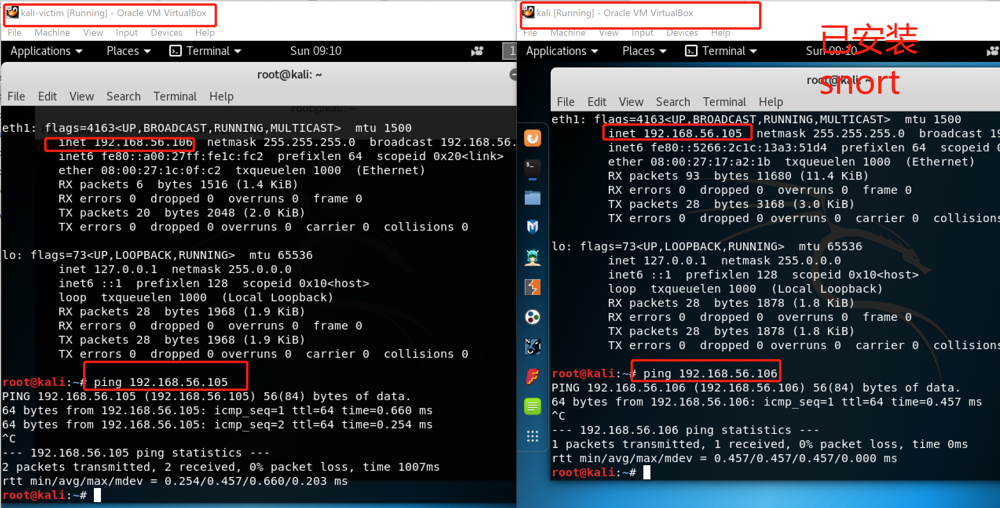
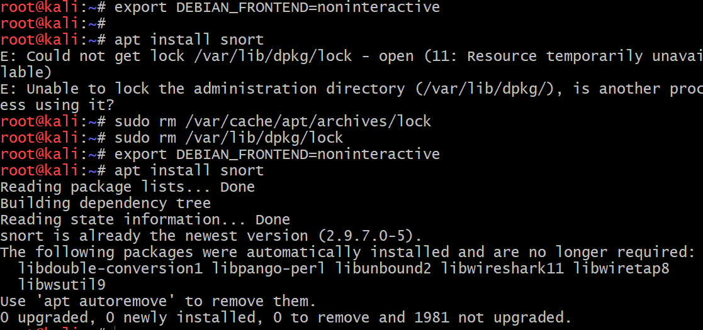

# 入侵检测
使用snort体验入侵检测
# 实验环境
两台kali虚拟机，可以相互ping通，其中一台安装snort

## 实验步骤
1. 安装snort
```
# 禁止在apt安装时弹出交互式配置界面
export DEBIAN_FRONTEND=noninteractive

apt install snort
```
2.配置snort为嗅探模式
```
# 显示IP/TCP/UDP/ICMP头
snort –v

# 显示应用层数据
snort -vd

# 显示数据链路层报文头
snort -vde

# -b 参数表示报文存储格式为 tcpdump 格式文件
# -q 静默操作，不显示版本欢迎信息和初始化信息
snort -q -v -b -i eth1 "port not 22"

# 使用 CTRL-C 退出嗅探模式
# 嗅探到的数据包会保存在 /var/log/snort/snort.log.<epoch timestamp>
# 其中<epoch timestamp>为抓包开始时间的UNIX Epoch Time格式串
# 可以通过命令 date -d @<epoch timestamp> 转换时间为人类可读格式
# exampel: date -d @1511870195 转换时间为人类可读格式
# 上述命令用tshark等价实现如下：
tshark -i eth1 -f "port not 22" -w 1_tshark.pcap
```
## 实验问题及解决
1. 资源被锁无法apt-get,报错如下图所示，[解决办法](https://blog.csdn.net/zyxlinux888/article/details/6358615)

## 参考文献
[教材](https://c4pr1c3.github.io/cuc-ns/chap0x09/exp.html)
理论学习-[网络安全中，入侵和渗透的区别](https://www.zhihu.com/question/40813012)