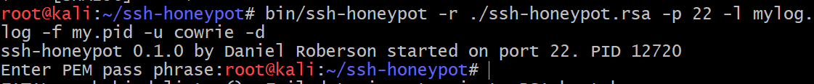
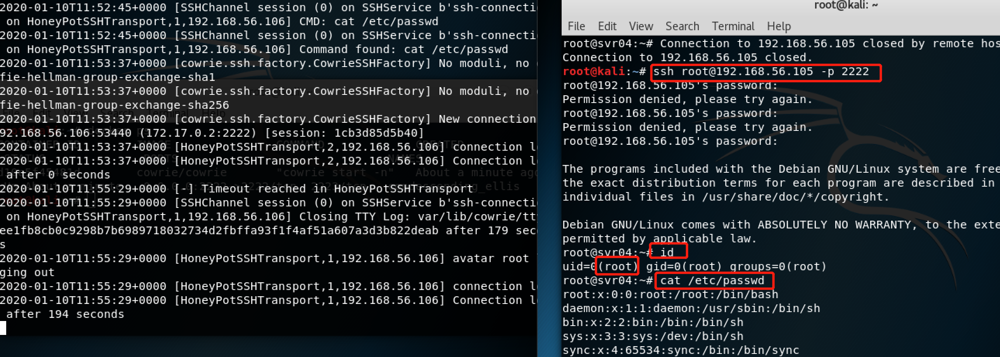
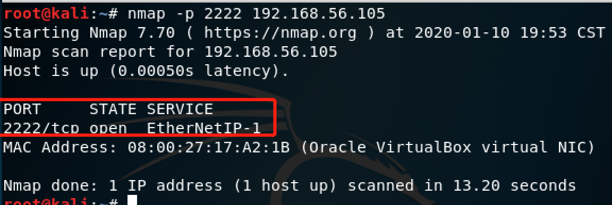

# 常见蜜罐体验和探索
## 实验目的
了解蜜罐的分类和基本原理
了解不同类型蜜罐的适用场合
掌握常见蜜罐的搭建和使用
## 实验环境
从 paralax/awesome-honeypots 中选择 1 种低交互蜜罐和 1 种中等交互蜜罐进行搭建实验
推荐 SSH 蜜罐
* 蜜罐分类：  
低交互：模拟服务和漏洞以便收集信息和恶意软件，但是攻击者无法和该系统进行交互；  
中等交互：在一个特有的控制环境中模拟一个生产服务，允许攻击者的部分交互；  
高交互：攻击者可以几乎自由的访问系统资源直至系统重新清除恢复。
## 实验要求
- [x] 蜜罐搭建
- [x] 使用 nmap 扫描搭建好的蜜罐并分析扫描结果，同时分析「 nmap 扫描期间」蜜罐上记录得到的信息
- [x] 如何辨别当前目标是一个「蜜罐」？以自己搭建的蜜罐为例进行说明
## 实验步骤
### ssh-Honeypot
#### 蜜罐搭建
1. 更改原有ssh服务端口号，将原来的22修改，选择60000以上的端口，不容易被扫描到.```sudo vi /etc/ssh/sshd_config```

2.重启ssh服务```sudo service ssh restart```
确保已安装libssh和libjson-c
```apt-get install && apt install libssh-dev libjson-c-dev```
4. 下载github ssh-honeypot蜜罐 ```git clone https://github.com/droberson/ssh-honeypot.git```
5. 安装运行过程（一直回车）
```cd ssh-honeypot
#安装libssh-dev库
sudo apt install libssh-dev
make
ssh-keygen -t rsa -f ./ssh-honeypot.rsa
#-l mylog.log选择日志文件，-u cowrie以刚才创建的cowrie身份运行，-d作为守护进程运行
bin/ssh-honeypot -r ./ssh-honeypot.rsa -p 22 -l mylog.log -f my.pid -u cowrie -d
```

### namp扫描蜜罐环境
1. 蜜罐(左)和攻击者(右)Ip信息如下：

2. 蜜罐开启监听22端口```bin/ssh-honeypot -p 20```  
攻击者通过ssh连接蜜罐
```ssh root@10.0.2.6 -p 20```

可以看到：对于攻击者，无论密码是否正确都被拒接连接，蜜罐中会记录攻击者的ip、尝试连接时间、连接时提交的用户名和密码。
3. 攻击者使用nmap扫描看到victim的22是开放的，且服务是22。nmap扫描的行为因为是监听是不会被记录的。

### cowrie蜜罐
#### 蜜罐搭建
1. 下载docker并启动
```
apt-get update && apt-get install docker docker-compose  
service docker start
```
2. 下载cowrie镜像并启用
```
docker pull cowrie/cowrie  
docker run -p 2222:2222 cowrie/cowrie
```
可以看到：cowrie是在2222和2223端口进行监听

#### nmap扫描蜜罐
1. 蜜罐(左)和攻击者(右)Ip信息如下：

2. 可以看到：ssh连接都被详细的在蜜罐中记录。并且获得的是root权限，可以使用和真实主机的命令，比如'cat /etc/passwd'

扫描所有端口看到只有两个端口在监听，2222端口的服务是ssh

固定端口2222，服务是EtherNetIP-1，和上图ssh的结果不一样，而且蜜罐日志中并没有记录

### 问题回答：如何辨别当前目标是一个「蜜罐」？
根据以上的实验结果，得出结论：
1. 多次ssh破解或者说你用正确的密码都显示连接不上，就很显然你进入到了一个蜜罐环境。
2. 扫描所有端口，会发现有些蜜罐的几乎所有的端口都是关闭的，常用的应用的没有对某个端口进行监听。比如cowrie所有端口扫描的结果。
3. 实验cowrie时发现长时间没有使用，会断开。
4. 根据cowrie的两次端口扫描，看到扫描所有端口和具体某一个端口时得到的服务信息不一样，而没有蜜罐启用是是一致的。
## 实验问题及解决
1. 安装时lock资源出错及解决如下图

## 参考文献
[在服务器上搭建简易的ssh蜜罐](https://blog.csdn.net/star92014/article/details/89260094)  
[SSH honeypot](https://jkme.github.io/ssh-honeypot.html)